# 全栈开发工程师课程 · 课程资料

> 本目录是本课程的讲义与资料库，配合 `assignments/`（作业）与 `work/`（学生成果）使用。
> 目标：让一名零基础学员在 24 周内建立完整全栈技术栈，并具备系统设计与架构能力。

## 一、资料结构

| 路径 | 内容 | 说明 |
| --- | --- | --- |
| `扩展阅读资料.md` | 互联网开源学习资源合集 | 每条链接附简介、GitHub 星标与「在哪个章节读它」 |
| `chapters/` | 章节化教程（本课程主体） | 14 章递进，每章含 README、多份讲义、实战 lab 与图解 |
| `术语表.md` | 中英术语速查表 | 阅读讲义时随时回查 |

每章目录内部统一使用同一套文件约定，便于自学与复习：

| 文件 | 作用 |
| --- | --- |
| `README.md` | 本章目标、知识地图、文件索引、完成标准 |
| `0x-*.md` | 讲义，一个主题一份，理论 + 代码 + 常见坑 |
| `labs/0x-*.md` | 动手实验，可运行的练习与验收清单 |
| `assets/*.svg` | 本章原理图／架构图，随讲义引用 |

## 二、学习路线（章节递进关系）

```mermaid
flowchart LR
  C00[00 课程导览] --> C01[01 开发环境与命令行]
  C01 --> C02[02 HTML 与 CSS]
  C02 --> C03[03 JavaScript 核心]
  C03 --> C04[04 前端工程化与 TypeScript]
  C04 --> C05[05 React 与前端应用]
  C05 --> C06[06 Node.js 与后端服务]
  C06 --> C07[07 数据库与数据建模]
  C07 --> C08[08 认证授权与 Web 安全]
  C08 --> C09[09 测试与代码质量]
  C09 --> C10[10 容器化 CI/CD 与部署]
  C10 --> C11[11 系统设计与架构]
  C11 --> C12[12 综合实战项目]
  C12 --> C13[13 职业发展与面试]
```

## 三、技术栈全景

| 层次 | 技术选型 | 对应章节 |
| --- | --- | --- |
| 开发环境 | Shell、Git、VS Code、Node.js、Docker | 01 |
| 表现层 | HTML5、CSS3、Flexbox/Grid、响应式、可访问性 | 02 |
| 编程语言 | JavaScript（ES2020+）、TypeScript | 03、04 |
| 前端框架 | React、React Router、TanStack Query、Zustand | 05 |
| 工程化 | npm/pnpm、Vite、ESLint、Prettier、Monorepo 概念 | 04、09 |
| 服务端 | Node.js、Express、Fastify、NestJS | 06 |
| 数据层 | PostgreSQL、Prisma、Redis、数据建模与索引 | 07 |
| 接口与安全 | REST、OpenAPI、GraphQL、JWT、OAuth2、OWASP | 06、08 |
| 质量保障 | Vitest、Testing Library、Playwright、CI 校验 | 09 |
| 交付运维 | Docker、GitHub Actions、云平台、日志与监控 | 10 |
| 架构能力 | 分层架构、缓存、消息队列、CAP、微服务、可观测性 | 11、12 |

## 四、建议节奏（24 周参考）

| 阶段 | 周次 | 章节 | 阶段产出 |
| --- | --- | --- | --- |
| 入门 | 1–5 | 00–03 | 个人主页 + 原生 JS 小应用 |
| 前端工程 | 6–10 | 04–05 | 带路由与数据请求的 SPA |
| 后端与数据 | 11–15 | 06–08 | 带认证的 REST API + 数据库 |
| 质量与交付 | 16–19 | 09–10 | 自动化测试 + CI/CD + 线上部署 |
| 架构与实战 | 20–24 | 11–13 | 系统设计文档 + 完整全栈项目 |

## 五、使用建议

1. **先读本章 README**，明确目标与产出，再进入讲义，最后做 lab。
2. **讲义配合 `扩展阅读资料.md` 使用**：每章 README 会指向对应的开源资料，作为深挖入口。
3. **每个 lab 都有验收清单**，做完请逐条自检；有条件时请同伴互评。
4. **图优先**：每章 `assets/` 中的架构图建议先看图、再读文字，最后自己默画一遍。
5. **成果统一放在 `work/<你的用户UUID>/<作业UUID>/`**，不要写进 `materials/`。

## 六、资料核验说明

`扩展阅读资料.md` 中的 GitHub 数据于 2026-10-07 通过 GitHub API 实测获取，星标数为当时快照；
外部站点链接均在本次核验中返回 HTTP 200。未通过本机网络连通性测试的站点未收录。
