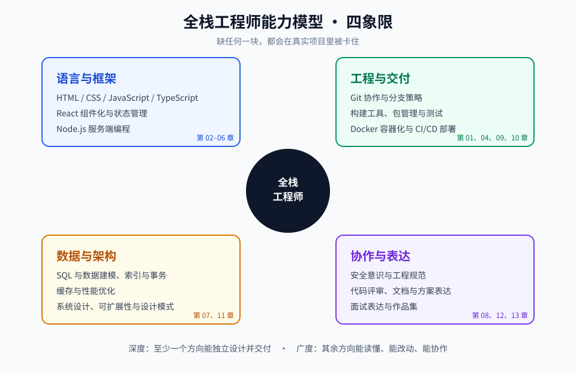

# 第 00 章 · 课程导览与学习方法

> 定位：用 4 小时把「我要成为什么样的工程师」和「我该怎么学」想清楚，再动手写代码。
> 这一章没有代码作业，产出是一份属于你自己的学习计划。

## 本章目标

- 建立全栈工程师的能力模型认知：知道「全栈」不是「样样稀松」，而是有纵深的 T 型能力。
- 理解本课程 14 章之间的递进关系，知道每一章在整个体系中的位置。
- 掌握本课程要求的三种学习动作：做笔记、提问题、定期复习。
- 产出一份可执行、可调整的 24 周学习计划。

## 文件索引

| 文件 | 内容 | 阅读方式 |
| --- | --- | --- |
| `README.md` | 本章目标与索引 | 现在读完 |
| [01-全栈工程师能力模型.md](01-全栈工程师能力模型.md) | 四象限能力模型、T 型结构、能力自评表 | 精读并完成自评 |
| [02-学习路线与节奏安排.md](02-学习路线与节奏安排.md) | 24 周计划、每周节奏、笔记与提问方法 | 精读并写计划 |
| `assets/capability-map.svg` | 能力模型图 | 先看图，学完默画 |

## 先记住这五条

1. **全栈是「一专多能」**：至少一个方向（前端或后端）达到能独立交付的深度，其余方向到「能协作、能读懂、能改动」的宽度。
2. **技术栈会过时，工程能力不会**：本课程更重视调试、抽象、拆解、设计的能力，而不是某个框架的 API 记忆。
3. **不写代码等于没学**：每章都有 lab，讲义看完必须动手；看得懂和写得出来之间隔着一整个太平洋。
4. **遇到问题先缩小范围**：最小可复现案例是工程师最重要的技能之一，比记住答案更重要。
5. **架构能力是「长」出来的**：它由前面 11 章的实践经验累积，第 11 章只是把它系统化。

## 延伸阅读

- [nilbuild/developer-roadmap](https://github.com/nilbuild/developer-roadmap)：先看全栈路线图建立全局视野（详见 `../../扩展阅读资料.md` B 组）。
- [roadmap.sh · Full Stack](https://roadmap.sh/full-stack)：在线版路线图，可勾选进度。
- [ossu/computer-science](https://github.com/ossu/computer-science)：想补计算机基础时按它排课。

## 完成标准

- [ ] 能对着白纸画出四象限能力模型，并说清每象限包含什么。
- [ ] 完成《01-全栈工程师能力模型.md》末尾的自评表，得到四个维度的分数。
- [ ] 按《02-学习路线与节奏安排.md》写出属于自己的 24 周计划（含每周固定学习时段）。
- [ ] 建立笔记仓库（可用本课程的 `work/` 目录），写下第一条学习日志。
