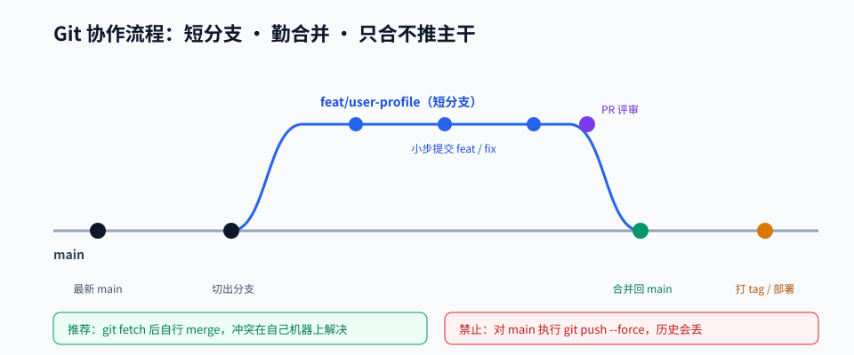

# 第 01 章 · 开发环境与命令行

> 定位：一次性把工具装好、把命令行和 Git 用顺。之后 13 章不再为环境问题浪费一整天。
> 本章产出：一份环境自检报告 + 一个带分支历史的 Git 练习仓库。

## 本章目标

- 理解终端、Shell、命令与 PATH 之间的关系，能独立排查「命令找不到」这类问题。
- 掌握 20 个日常最高频的命令行操作，包括管道、重定向与环境变量。
- 掌握 Git 的三个区域、分支模型与冲突解决流程，能完成一次模拟团队协作。
- 搭好本课程所需的全部工具链：Node、包管理器、编辑器、Docker、数据库。

## 文件索引

| 文件 | 内容 | 阅读方式 |
| --- | --- | --- |
| [01-命令行与Shell基础.md](01-命令行与Shell基础.md) | 终端概念、必备命令、管道、环境变量、排查技巧 | 精读 + 逐条敲一遍 |
| [02-Git与GitHub协作.md](02-Git与GitHub协作.md) | Git 模型、命令速查、分支策略、冲突解决、提交规范 | 精读 |
| [03-本地开发环境搭建清单.md](03-本地开发环境搭建清单.md) | 工具清单、版本管理、编辑器配置、数据库与缓存 | 按清单执行 |
| [labs/01-环境自检与Git练习.md](labs/01-环境自检与Git练习.md) | 动手实验：环境自检 + 分支协作演练 | 动手完成 |
| `assets/git-workflow.svg` | 分支与协作流程图 | 先看图建立直觉 |

## 环境清单速览

| 工具 | 版本建议 | 验证命令 | 期望结果 |
| --- | --- | --- | --- |
| Node.js | 20 LTS 或 22 LTS | `node -v` | 输出 v20.x / v22.x |
| 包管理器 | npm 10+ 或 pnpm 9+ | `npm -v` | 输出版本号 |
| Git | 2.40+ | `git --version` | 输出版本号 |
| 编辑器 | VS Code 最新版 | `code --version` | 输出版本号 |
| Docker | 最新稳定版 | `docker version` | 显示 Client 与 Server |
| 数据库 | PostgreSQL 16 | `docker ps` | 容器状态为 Up |

> 详细安装步骤、图形化替代方案与常见报错处理见《03-本地开发环境搭建清单.md》。

## 三条铁律

1. **不要跳过环境验证**：每个工具装完立刻跑一次验证命令，别等到第 10 章才发现 Docker 没装对。
2. **命令要理解，不要背**：看不懂的命令先跑 `--help`，或查第 01 章讲义里的表格。
3. **提交要小而频繁**：一次提交只做一件事，历史能读懂，回滚才敢做。

## 延伸阅读

- [jlevy/the-art-of-command-line](https://github.com/jlevy/the-art-of-command-line)：一页纸覆盖命令行精华，读完本章讲义再看。
- [Pro Git 中文版](https://git-scm.com/book/zh/v2)：Git 权威教程，分支与内部原理部分必读。
- [12factor.net 配置章节](https://12factor.net/zh_cn/config)：理解为什么配置要放在环境变量里。

## 完成标准

- [ ] 六个工具全部安装完成，并在自检报告中记录每个验证命令的输出。
- [ ] 能解释「工作区／暂存区／本地仓库」三个概念，并说出 `git status` 中每种文件状态的含义。
- [ ] 完成至少一次真实的冲突解决（Lab 中会人为制造一次冲突）。
- [ ] 提交历史中出现至少 3 次、符合规范格式的提交信息。
