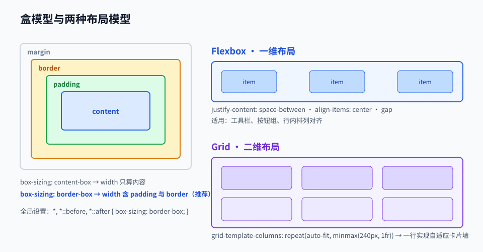

# 第 02 章 · HTML 与 CSS

> 定位：从「能显示」升级到「结构正确、样式可控、任何屏幕都能用」。
> 本章产出：一个响应式个人主页（移动端优先，含无障碍基本要求）。

## 本章目标

- 用语义化标签组织页面结构，并说清每个标签为什么比 `div` 更合适。
- 掌握盒模型、层叠与优先级，能解释「为什么我的样式没生效」。
- 熟练使用 Flexbox 与 Grid 完成一维与二维布局。
- 用移动优先 + 媒体查询 + 相对单位实现真正的响应式。
- 写出满足基本可访问性要求（键盘可达、对比度、替代文本）的页面。

## 文件索引

| 文件 | 内容 | 阅读方式 |
| --- | --- | --- |
| [01-HTML语义化与可访问性.md](01-HTML语义化与可访问性.md) | 文档骨架、语义标签、表单、无障碍、SEO 基础 | 精读 + 抄写骨架 |
| [02-CSS布局与响应式设计.md](02-CSS布局与响应式设计.md) | 盒模型、选择器、Flexbox、Grid、响应式与动画 | 精读 + 逐个属性试 |
| [labs/01-个人主页实战.md](labs/01-个人主页实战.md) | 动手实验：响应式个人主页 | 动手完成 |
| `assets/css-layout.svg` | 盒模型与布局模型对照图 | 先看图 |

## 核心概念速览

| 概念 | 一句话理解 | 典型误区 |
| --- | --- | --- |
| 语义化 | 标签描述内容含义，而非外观 | 用 `div` 堆出整个页面 |
| 盒模型 | 元素 = content + padding + border + margin | 不知道 `box-sizing: border-box` 的作用 |
| 层叠与优先级 | 多条规则冲突时按权重与顺序决定 | 靠 `!important` 硬压 |
| Flexbox | 一维布局，擅长行或列内的对齐与分配 | 用它做整页二维骨架 |
| Grid | 二维布局，擅长整页分区 | 用它做单行按钮组 |
| 响应式 | 同一份代码适配不同屏幕 | 只适配桌面再补丁式适配手机 |
| 相对单位 | `rem`/`em`/`%`/`vh` 随环境变化 | 全站写死 `px` |

## 三条纪律

1. **先结构后样式**：先把 HTML 写成语义正确的骨架，再写 CSS；不要边调样式边补标签。
2. **移动优先**：默认样式面向小屏，再用 `min-width` 媒体查询增强大屏。
3. **少用 `!important`**：它出现通常说明选择器设计有问题，优先改选择器或调整结构。

## 延伸阅读

- [MDN 学习区 · HTML 与 CSS](https://developer.mozilla.org/zh-CN/docs/Learn)：本章所有知识点的权威参考。
- [microsoft/Web-Dev-For-Beginners](https://github.com/microsoft/Web-Dev-For-Beginners)：有配套练习与测验，适合课后巩固。
- [TheOdinProject/curriculum](https://github.com/TheOdinProject/curriculum)：项目驱动的 HTML/CSS 练习。

## 完成标准

- [ ] 个人主页在 375px、768px、1440px 三种宽度下都不出现横向滚动条或错位。
- [ ] 页面结构全部使用语义标签，只有一个 `<h1>`，标题层级不跳级。
- [ ] 所有图片有 `alt`，所有交互元素可用键盘 Tab 到达并有可见焦点样式。
- [ ] 正文对比度达到 WCAG AA（用浏览器 Lighthouse 或对比度工具自查）。
- [ ] CSS 中 `!important` 出现次数为 0。