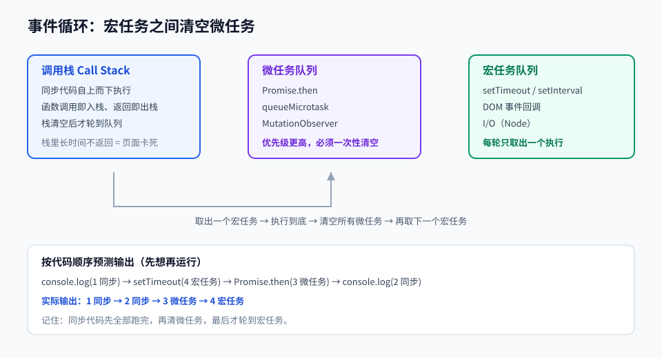

# 第 03 章 · JavaScript 核心

> 定位：把 JavaScript 从「能写」练到「知道为什么」——这一章决定你后面 10 章的天花板。
> 本章产出：一个原生 JavaScript 待办应用（含本地持久化与键盘操作）。

## 本章目标

- 掌握类型系统、作用域、闭包、`this` 与原型链五个核心机制。
- 能用 Promise 与 `async/await` 正确写出并发与串行逻辑，并解释微任务与宏任务的执行顺序。
- 理解浏览器渲染管线，知道什么操作会触发重排与重绘。
- 独立完成一个不依赖框架的交互应用，具备事件委托与状态管理的基本思路。

## 文件索引

| 文件 | 内容 | 阅读方式 |
| --- | --- | --- |
| [01-语言基础与作用域闭包.md](01-语言基础与作用域闭包.md) | 类型、作用域、闭包、this、原型、数组方法 | 精读 + 逐段跑通 |
| [02-异步编程与事件循环.md](02-异步编程与事件循环.md) | 事件循环、Promise、async/await、fetch、取消请求 | 精读 + 动手验证输出顺序 |
| [03-DOM与浏览器渲染.md](03-DOM与浏览器渲染.md) | 渲染管线、事件流与委托、性能与存储 | 精读 |
| [labs/01-待办应用实战.md](labs/01-待办应用实战.md) | 动手实验：原生 JS 待办应用 | 动手完成 |
| `assets/event-loop.svg` | 事件循环结构图 | 先看图 |

## 三条纪律

1. **优先 `const`**：只有确实要重新赋值时才用 `let`，永远不用 `var`。
2. **默认 `===`**：只有明确需要类型转换时才用 `==`。
3. **先搞清执行顺序再写异步**：不确定时，`console.log` 顺序是最好的老师。

## 延伸阅读

- [现代 JavaScript 教程（中文）](https://zh.javascript.info/)：本章主教材，讲解细致且持续更新。
- [MDN · JavaScript 参考](https://developer.mozilla.org/zh-CN/docs/Web/JavaScript)：查任何内置方法的第一选择。
- [33-js-concepts](https://github.com/leonardomso/33-js-concepts)：用来检查自己的知识盲区。

## 完成标准

- [ ] 能解释「输出顺序」类问题：`setTimeout`、`Promise.then`、同步代码谁先执行。
- [ ] 能写出一个闭包并说明它保留了哪个变量、为什么不会泄漏到全局。
- [ ] 待办应用支持增、删、改、筛选、本地持久化与键盘操作。
- [ ] 能用事件委托处理动态生成的列表项事件。