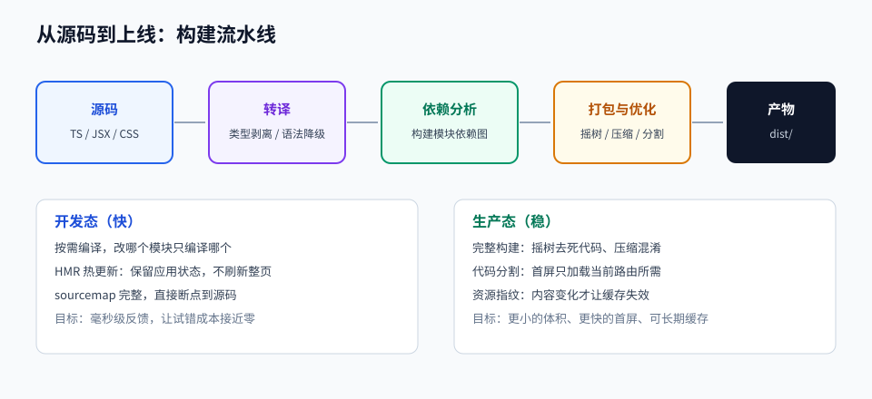

# 第 04 章 · 前端工程化与 TypeScript

> 定位：从「写一个文件」到「维护一个工程」——这一章决定你的代码能不能被别人接手。
> 本章产出：一个从零搭建、带类型检查与构建优化的 TypeScript 工程。

## 本章目标

- 理解模块系统（ESM / CommonJS）与包管理的依赖解析、版本锁定机制。
- 说清构建工具在做什么（转译、打包、压缩、代码分割、HMR），并会做基本配置。
- 掌握 TypeScript 的核心类型工具：接口、联合、泛型、收窄、工具类型。
- 能读懂并编写 `tsconfig.json`、`vite.config.ts`、ESLint 配置。

## 文件索引

| 文件 | 内容 | 阅读方式 |
| --- | --- | --- |
| [01-模块化与包管理.md](01-模块化与包管理.md) | ESM/CJS、依赖类型、语义化版本、锁文件、Monorepo | 精读 |
| [02-构建工具与工程配置.md](02-构建工具与工程配置.md) | 构建流程、Vite 配置、环境变量、路径别名、代理 | 精读 + 动手改配置 |
| [03-TypeScript核心与类型设计.md](03-TypeScript核心与类型设计.md) | 类型系统、泛型、收窄、工具类型、类型设计原则 | 精读 + 写类型体操 |
| [labs/01-从零搭建TS工程.md](labs/01-从零搭建TS工程.md) | 动手实验：搭建可构建、可检查、可测试的工程 | 动手完成 |
| `assets/build-pipeline.svg` | 从源码到产物的流水线图 | 先看图 |

## 三条纪律

1. **依赖要少而明**：每加一个依赖，都问「它解决了什么、能不能自己写 30 行代替、维护活跃吗」。
2. **配置要能解释**：`tsconfig` 里每一行都该知道作用，抄来的配置是负债。
3. **类型是设计工具**：先用类型把数据形状定清楚，再写实现；不要写完再补 `any`。

## 延伸阅读

- [Vite 官方中文文档](https://cn.vitejs.dev/)：配置项与插件体系以此为准。
- [TypeScript 官方手册](https://www.typescriptlang.org/docs/handbook/intro.html)：类型系统权威参考。
- [typescript-cheatsheets/react](https://github.com/typescript-cheatsheets/react)：为第 05 章预热。
- [airbnb/javascript](https://github.com/airbnb/javascript)：风格与取舍背后的理由。

## 完成标准

- [ ] 能解释 `dependencies` 与 `devDependencies` 的区别，以及锁文件为什么必须提交。
- [ ] 能画出并讲清「源码 → 构建 → 产物 → 部署」的完整流水线。
- [ ] 工程中不出现 `any`；至少使用一次泛型与一次工具类型。
- [ ] `npm run build` 与 `npm run typecheck` 都能通过，产物可被静态服务器打开。