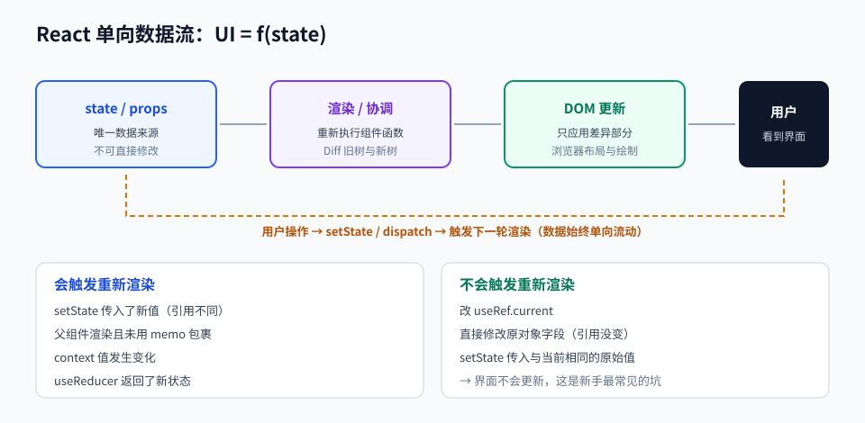

# 第 05 章 · React 与前端应用开发

> 定位：把「操作 DOM」的思维，换成「描述状态与界面关系」的思维——这是现代前端的核心跃迁。
> 本章产出：一个带路由、数据请求、状态管理与测试的单页应用（SPA）。

## 本章目标

- 理解声明式渲染、组件、单向数据流与协调（reconciliation）机制。
- 熟练使用核心 Hooks（`useState`、`useEffect`、`useMemo`、`useRef`、`useReducer`、自定义 Hook）。
- 能用路由组织多页面、用数据请求库处理缓存与加载态、用状态管理库处理跨页面共享状态。
- 能定位并修复常见性能问题（无效重渲染、状态位置不当、列表 key 错误）。

## 文件索引

| 文件 | 内容 | 阅读方式 |
| --- | --- | --- |
| [01-组件化与Hooks.md](01-组件化与Hooks.md) | JSX、props/state、核心 Hooks、自定义 Hook、生命周期思维 | 精读 + 逐个改造 |
| [02-路由状态与数据请求.md](02-路由状态与数据请求.md) | 路由、状态提升与共享、服务端状态、表单处理 | 精读 |
| [03-前端性能与测试.md](03-前端性能与测试.md) | 重渲染分析、memo、代码分割、组件测试 | 精读 |
| [labs/01-SPA实战.md](labs/01-SPA实战.md) | 动手实验：完整单页应用 | 动手完成 |
| `assets/react-dataflow.svg` | 单向数据流与渲染时机图 | 先看图 |

## 三条纪律

1. **状态是唯一真相**：界面由状态推导，不要手动去改 DOM。
2. **状态放在需要它的最近公共祖先**：放得太低会重复、放得太高会连坐重渲染。
3. **不在渲染期间做副作用**：请求、订阅、定时器一律放 `useEffect` 或事件处理里。

## 延伸阅读

- [React 官方文档 · Learn](https://react.dev/learn)：本章主教材，含「Thinking in React」。
- [enaqx/awesome-react](https://github.com/enaqx/awesome-react)：生态选型参考。
- [typescript-cheatsheets/react](https://github.com/typescript-cheatsheets/react)：组件与 Hooks 的类型写法。
- [testing-library/react-testing-library](https://github.com/testing-library/react-testing-library)：组件测试的推荐姿势。

## 完成标准

- [ ] 应用包含至少 4 个路由页面，含一个带参数的路由与一个 404 页面。
- [ ] 数据请求有加载态、错误态、空态三种界面分支。
- [ ] 至少封装 2 个自定义 Hook，且被复用 2 处以上。
- [ ] 能用 React DevTools Profiler 指出一次不必要的重渲染并修复它。
- [ ] 组件测试覆盖「加载中 → 加载成功 → 请求失败」三条路径。