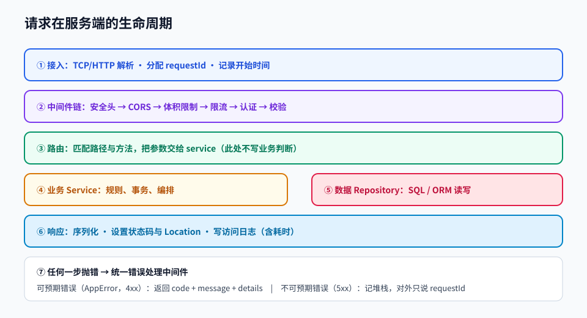

# 第 06 章 · Node.js 与后端服务

> 定位：从「浏览器里写 JS」到「服务器上跑 JS」——理解请求如何变成数据，数据如何变成响应。
> 本章产出：一个分层清晰、带校验、日志与统一错误处理的 REST API。

## 本章目标

- 理解 Node 的运行时特性：单线程、事件循环、非阻塞 I/O、模块系统。
- 说清 HTTP 请求与响应的完整结构，并遵守 REST 设计约定。
- 用分层架构（路由 → 服务 → 数据访问）写服务，避免业务逻辑散落在路由里。
- 实现统一错误处理、入参校验、结构化日志与优雅关闭。

## 文件索引

| 文件 | 内容 | 阅读方式 |
| --- | --- | --- |
| [01-Node运行时与服务端基础.md](01-Node运行时与服务端基础.md) | 事件循环、模块、文件与流、进程与环境变量 | 精读 |
| [02-HTTP协议与REST接口设计.md](02-HTTP协议与REST接口设计.md) | 报文结构、方法与状态码、资源设计、分页与版本 | 精读 |
| [03-服务端框架实战.md](03-服务端框架实战.md) | Express/Fastify 结构、中间件、校验、错误与日志 | 精读 + 照抄骨架 |
| [labs/01-构建REST服务.md](labs/01-构建REST服务.md) | 动手实验：从零写一个 REST API | 动手完成 |
| `assets/node-request-lifecycle.svg` | 请求在服务端的完整生命周期 | 先看图 |

## 三条纪律

1. **路由里不写业务逻辑**：路由只负责解析请求与返回响应，业务在 service，数据访问在 repository。
2. **所有外部输入都要校验**：请求体、查询参数、路径参数、请求头，一个都不能信。
3. **错误必须被统一处理**：不要在几十个地方各自 `res.status(500)`，用错误处理中间件集中收敛。

## 延伸阅读

- [Node.js 官方中文文档](https://nodejs.org/zh-cn/docs)：运行时 API 权威参考。
- [nodebestpractices](https://github.com/goldbergyoni/nodebestpractices)：本章读完逐条对照自己的代码。
- [microsoft/api-guidelines](https://github.com/microsoft/api-guidelines) 与 [OpenAPI 规范](https://github.com/OAI/OpenAPI-Specification)：接口设计规范。
- [realworld-apps/realworld](https://github.com/realworld-apps/realworld)：真实项目的前后端契约参考。

## 完成标准

- [ ] API 有完整的 CRUD 接口，状态码使用正确（201/204/400/404/409）。
- [ ] 入参校验失败返回字段级错误信息，而不是笼统的「参数错误」。
- [ ] 有统一的错误处理中间件与统一响应结构。
- [ ] 日志包含请求 id、方法、路径、耗时、状态码。
- [ ] 收到终止信号能优雅关闭：停止接收新请求、等待在途请求结束后退出。