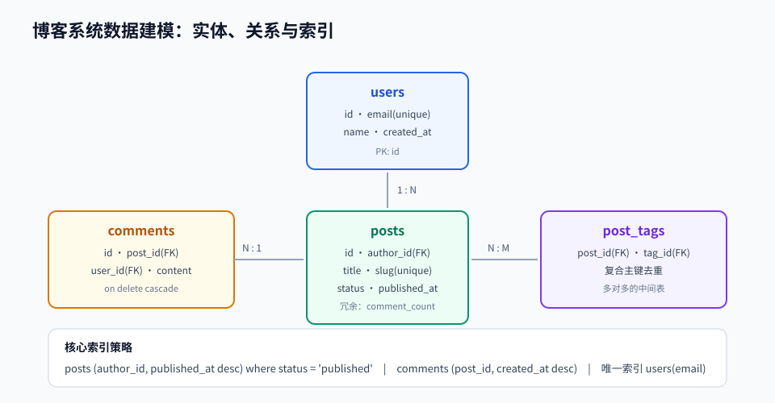

# 第 07 章 · 数据库与数据建模

> 定位：数据是应用真正的资产。这一章教你「怎么把业务画成表」以及「怎么让查询跑得快」。
> 本章产出：一份博客系统的数据库设计文档 + 迁移脚本 + 一份查询优化前后对比。

## 本章目标

- 熟练编写 SQL：多表连接、聚合分组、子查询与窗口函数。
- 能按规范化原则设计表结构，并知道何时该反规范化。
- 理解索引原理与代价，能为真实查询选出正确的索引。
- 掌握事务与隔离级别，能识别并修复并发写入问题。
- 会用 ORM 与迁移脚本管理表结构演进，能识别并消除 N+1 查询。

## 文件索引

| 文件 | 内容 | 阅读方式 |
| --- | --- | --- |
| [01-SQL与关系型数据库.md](01-SQL与关系型数据库.md) | 查询、连接、聚合、子查询、窗口函数 | 精读 + 在 psql 里跑 |
| [02-数据建模索引与事务.md](02-数据建模索引与事务.md) | 规范化、主外键、索引策略、事务与隔离级别 | 精读 |
| [03-ORM迁移与缓存.md](03-ORM迁移与缓存.md) | ORM 用法、N+1、迁移管理、Redis 缓存模式 | 精读 |
| [labs/01-设计博客数据库.md](labs/01-设计博客数据库.md) | 动手实验：设计并优化博客数据库 | 动手完成 |
| `assets/db-modeling.svg` | 表关系与索引示意图 | 先看图 |

## 三条纪律

1. **先设计再写代码**：表结构一旦有数据就很难改，动手前先画 ER 图。
2. **查询必须走索引**：任何列表接口的 SQL 都要用 `EXPLAIN ANALYZE` 看过执行计划。
3. **迁移脚本不可修改历史**：已执行的迁移只能追加，不能改内容或删除。

## 延伸阅读

- [PostgreSQL 官方文档](https://www.postgresql.org/docs/)：SQL 语法与性能调优权威参考。
- [Redis 官方文档](https://redis.io/docs/latest/)：缓存数据结构与持久化。
- [prisma/orm](https://github.com/prisma/orm)：本章 ORM 主教材。
- [nodebestpractices](https://github.com/goldbergyoni/nodebestpractices)：数据库部分的工程实践。

## 完成标准

- [ ] 能画出博客系统的 ER 图，说明每张表的职责与关系基数。
- [ ] 写出至少一个多表连接聚合查询与一个窗口函数查询。
- [ ] 用 `EXPLAIN ANALYZE` 证明某个查询用上了索引，并记录优化前后的耗时。
- [ ] 演示一次并发写冲突，并用事务或乐观锁修复。
- [ ] 迁移脚本能从空库一路建到当前结构，且可重复执行。