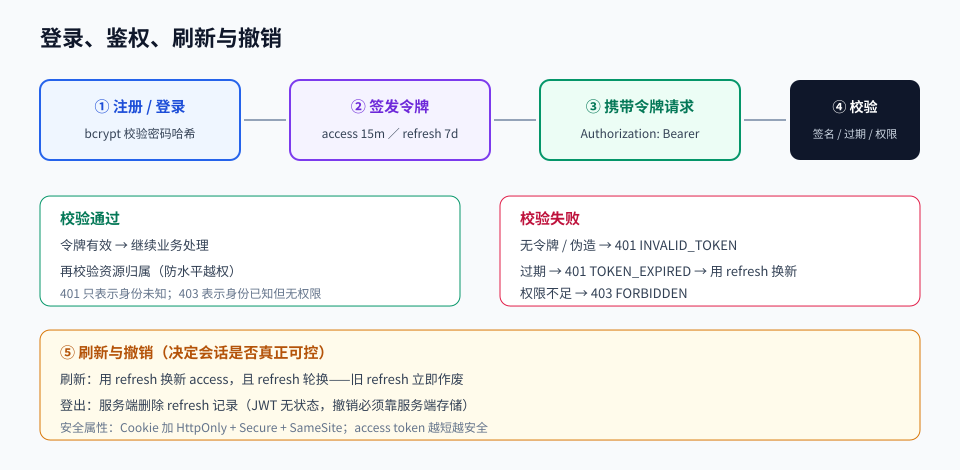

# 第 08 章 · 认证授权与 Web 安全

> 定位：安全不是功能，是底线。这一章把「谁能进来、能做什么、会被怎么攻击」讲透。
> 本章产出：带注册登录、会话管理、权限控制的 API，以及一份安全自查报告。

## 本章目标

- 分清认证（你是谁）与授权（你能做什么），并选对会话方案（Cookie Session / JWT）。
- 正确实现密码存储、令牌签发与刷新、注销与撤销。
- 理解 OWASP Top 10 中与 Web 应用最相关的风险，并知道每种风险的防御手段。
- 能对已有接口做一次系统性的安全自查。

## 文件索引

| 文件 | 内容 | 阅读方式 |
| --- | --- | --- |
| [01-认证与授权机制.md](01-认证与授权机制.md) | 会话方案对比、密码哈希、令牌、刷新与撤销、RBAC | 精读 |
| [02-Web安全与OWASP-Top10.md](02-Web安全与OWASP-Top10.md) | 注入、XSS、CSRF、越权、敏感信息泄露、限流 | 精读 |
| [labs/01-安全登录与权限实战.md](labs/01-安全登录与权限实战.md) | 动手实验：实现安全登录与权限控制 | 动手完成 |
| `assets/auth-flow.svg` | 登录、鉴权、刷新、注销全流程 | 先看图 |

## 三条纪律

1. **密码只存哈希，永不存明文**：用 bcrypt／argon2，并加盐。
2. **服务端必须再校验一次权限**：前端隐藏按钮不是安全措施。
3. **不信任任何输入**：所有来自客户端的字段都必须校验、转义或参数化。

## 延伸阅读

- [OWASP Top 10](https://owasp.org/www-project-top-ten/)：风险清单权威来源。
- [OWASP/CheatSheetSeries](https://github.com/OWASP/CheatSheetSeries)：每种风险的防御速查表。
- [MDN · HTTP 认证与 Cookie](https://developer.mozilla.org/zh-CN/docs/Web/HTTP)：`HttpOnly`、`SameSite` 等属性说明。

## 完成标准

- [ ] 注册接口用 bcrypt（cost ≥ 10）存储密码哈希，日志中不出现密码与令牌。
- [ ] 登录后可访问受保护接口；无令牌或令牌过期返回 401；权限不足返回 403。
- [ ] 令牌有明确有效期，并实现刷新或过期重新登录流程。
- [ ] 用户只能访问自己的数据：越权测试（改 id 访问他人资源）返回 403 或 404。
- [ ] 完成一份覆盖 OWASP Top 10 的自查报告，每项写明「现状／风险／措施」。