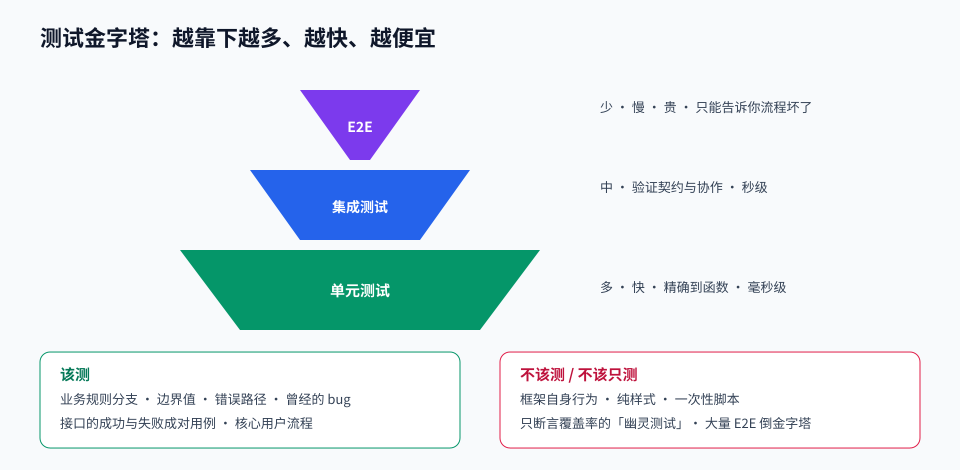

# 第 09 章 · 测试与代码质量

> 定位：测试不是为了证明代码正确，而是为了让你敢改代码。
> 本章产出：覆盖三层测试的项目 + 一份 CI 检查脚本 + 一次代码评审记录。

## 本章目标

- 理解测试金字塔与各层的成本收益，知道什么该测、什么不值得测。
- 会写单元测试、集成测试与端到端测试，并让它们稳定不抖动。
- 建立可执行的代码质量门槛：类型检查、静态检查、格式化、提交规范。
- 能给出有价值的代码评审意见，也能接受别人的评审。

## 文件索引

| 文件 | 内容 | 阅读方式 |
| --- | --- | --- |
| [01-测试金字塔与单元测试.md](01-测试金字塔与单元测试.md) | 测试策略、结构、断言、Mock 与边界用例 | 精读 |
| [02-集成测试与E2E测试.md](02-集成测试与E2E测试.md) | 接口测试、数据库隔离、E2E 与抖动治理 | 精读 |
| [03-代码质量与协作规范.md](03-代码质量与协作规范.md) | Lint、格式化、提交钩子、CI 门槛、代码评审 | 精读 |
| [labs/01-为API补齐测试.md](labs/01-为API补齐测试.md) | 动手实验：给 REST API 补齐测试 | 动手完成 |
| `assets/test-pyramid.svg` | 测试金字塔与成本曲线 | 先看图 |

## 三条纪律

1. **测试行为而非实现**：只要对外表现不变，重构就不该让测试挂掉。
2. **每个测试独立**：不依赖执行顺序、不共享可变状态、可单独运行。
3. **修 bug 先写一个失败的测试**：它既复现了问题，也防止它再次出现。

## 延伸阅读

- [javascript-testing-best-practices](https://github.com/goldbergyoni/javascript-testing-best-practices)：本章主教材。
- [vitest](https://github.com/vitest-dev/vitest)：测试运行器。
- [react-testing-library](https://github.com/testing-library/react-testing-library)：组件测试哲学与用法。
- [clean-code-javascript](https://github.com/ryanmcdermott/clean-code-javascript)：命名与函数设计的实用建议。

## 完成标准

- [ ] 单元测试覆盖核心业务函数，含边界与异常用例。
- [ ] 集成测试覆盖每个接口的成功与至少一种失败路径。
- [ ] 至少一个端到端测试覆盖「登录 → 创建 → 查看」主流程。
- [ ] CI 脚本串联类型检查、静态检查、测试与构建，全绿才算通过。
- [ ] 完成一次代码评审：既要给出意见，也要处理别人给你的意见。