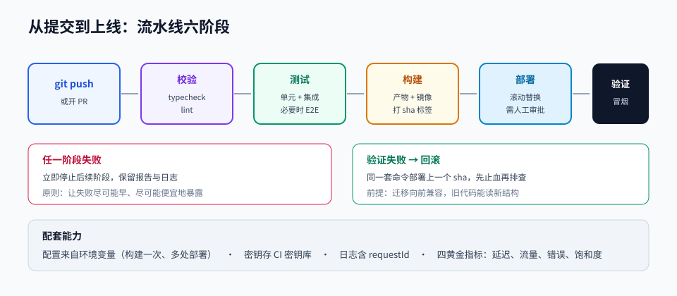

# 第 10 章 · 容器化、CI/CD 与部署

> 定位：把「在我电脑上能跑」变成「在任何人、任何机器上都能跑」。
> 本章产出：多阶段构建的镜像 + 可重复的流水线 + 一个公网可访问的部署。

## 本章目标

- 理解镜像、容器、仓库与编排的层次关系，能读懂并编写 Dockerfile。
- 用 Compose 一键起本地全套依赖（应用 + 数据库 + 缓存）。
- 设计一条从提交到上线的流水线：校验、构建、测试、发布、部署、回滚。
- 掌握配置管理、健康检查、日志与回滚等上线必备能力。

## 文件索引

| 文件 | 内容 | 阅读方式 |
| --- | --- | --- |
| [01-Docker与容器化.md](01-Docker与容器化.md) | 镜像层次、Dockerfile 优化、Compose、数据持久化 | 精读 + 动手构建 |
| [02-CICD与部署运维.md](02-CICD与部署运维.md) | 流水线设计、环境与密钥、部署策略、回滚与观测 | 精读 |
| [labs/01-容器化并自动部署.md](labs/01-容器化并自动部署.md) | 动手实验：容器化并上线 | 动手完成 |
| `assets/cicd-pipeline.svg` | 从提交到上线的流水线 | 先看图 |

## 三条纪律

1. **配置来自环境变量**：镜像里不含任何环境相关的值，一次构建多处部署。
2. **镜像要小而稳定**：固定基础镜像版本，多阶段构建，非 root 运行。
3. **部署必须可回滚**：每次发布都有版本标识，回滚是一条命令而不是一次排查。

## 延伸阅读

- [docker/awesome-compose](https://github.com/docker/awesome-compose)：可直接抄改的 Compose 示例。
- [The Twelve-Factor App（中文）](https://12factor.net/zh_cn/)：可部署应用的十二条原则。
- [bregman-arie/devops-exercises](https://github.com/bregman-arie/devops-exercises)：DevOps 知识自测。
- [Kubernetes 官方中文教程](https://kubernetes.io/zh-cn/docs/tutorials/)：容器编排延伸。

## 完成标准

- [ ] 应用镜像可构建，`docker run` 即可启动并响应 `/health`。
- [ ] 用 Compose 一条命令起「应用 + 数据库 + 缓存」，数据卷持久化生效。
- [ ] 镜像使用多阶段构建，最终镜像不包含开发依赖与源码构建工具。
- [ ] 流水线在推送后自动执行校验与构建，并为镜像打上版本标签。
- [ ] 部署到公网可访问，且能演示一次回滚。