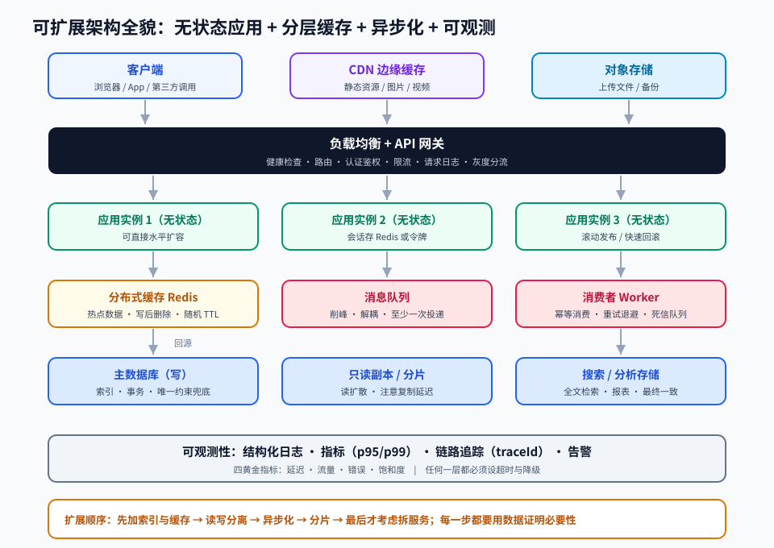

# 第 11 章 · 系统设计与架构

> 定位：从「把功能写出来」到「让系统扛得住、改得动、查得到」。这是全栈工程师与「会写代码的人」的分水岭。
> 本章产出：一份可评审的系统设计文档（含架构图、容量估算与取舍分析）。

## 本章目标

- 掌握架构基础：分层与边界、模块化、SOLID、常用设计模式与耦合度量。
- 能对给定业务做容量估算，并据此选择扩展手段（加缓存、读写分离、分片、异步化）。
- 理解 CAP、一致性模型、幂等与分布式事务的基本取舍。
- 读懂并画出典型分布式架构：网关、服务、队列、缓存、存储、观测。
- 能写出一份包含「需求 → 估算 → 方案 → 取舍 → 风险」的完整设计文档。

## 文件索引

| 文件 | 内容 | 阅读方式 |
| --- | --- | --- |
| [01-架构基础与设计原则.md](01-架构基础与设计原则.md) | 分层、边界、SOLID、设计模式、耦合与内聚 | 精读 |
| [02-可扩展性与性能设计.md](02-可扩展性与性能设计.md) | 负载均衡、无状态、缓存、数据库扩展、异步化 | 精读 |
| [03-分布式系统与高可用.md](03-分布式系统与高可用.md) | CAP、一致性、消息队列、微服务、容错与可观测性 | 精读 |
| [labs/01-短链系统架构设计.md](labs/01-短链系统架构设计.md) | 动手实验：完整系统设计文档 | 动手完成 |
| `assets/scalable-architecture.svg` | 典型可扩展架构全貌 | 先看图 |

## 三条纪律

1. **先问需求与约束**：没有流量规模、一致性要求与预算，任何架构讨论都是空谈。
2. **一切设计都是取舍**：说出你放弃了什么，比说出你用了什么更重要。
3. **不要过早复杂化**：单体 + 一台数据库能解决的问题，不要上微服务。

## 延伸阅读

- [karanpratapsingh/system-design](https://github.com/karanpratapsingh/system-design)：结构清晰，建议第一遍读它。
- [donnemartin/system-design-primer](https://github.com/donnemartin/system-design-primer)：体系完整，含面试题与卡片。
- [awesome-scalability](https://github.com/binhnguyennus/awesome-scalability)：真实大规模系统案例。
- [design-patterns-for-humans](https://github.com/nilbuild/design-patterns-for-humans)：设计模式速览。
- [awesome-software-architecture](https://github.com/mehdihadeli/awesome-software-architecture)：架构风格与 DDD 资源。
- [microservices-demo](https://github.com/GoogleCloudPlatform/microservices-demo)：可运行的服务拆分示例。

## 完成标准

- [ ] 能对给定业务做量级估算（QPS、存储、带宽），并说明假设。
- [ ] 能画出包含网关、服务、缓存、队列、数据库与观测的架构图。
- [ ] 设计文档含至少三处明确的取舍分析与风险清单。
- [ ] 能解释在自己的设计里「哪里可能先崩」以及对应的降级方案。