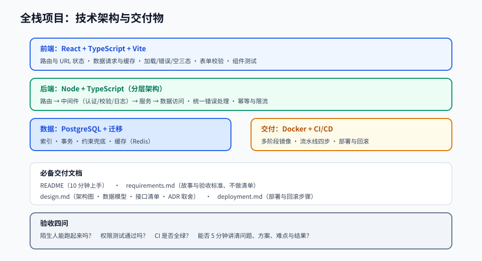

# 第 12 章 · 综合实战项目

> 定位：把前 11 章的能力合成一个能拿出手的作品。这一章没有新知识点，只有「怎么把事做成」。
> 本章产出：一个端到端全栈项目——需求、设计、代码、测试、部署、文档全部齐备。

## 本章目标

- 把模糊想法变成清晰需求：用户故事、验收标准、范围边界。
- 做出可辩护的技术选型：每个选择都能说出理由与代价。
- 用迭代的方式推进：每轮都有可运行、可演示的产出。
- 完成生产级交付：测试、CI/CD、部署、文档、演示材料。

## 文件索引

| 文件 | 内容 | 阅读方式 |
| --- | --- | --- |
| [01-需求分析与技术选型.md](01-需求分析与技术选型.md) | 用户故事、验收标准、范围控制、选型决策记录 | 精读 + 填模板 |
| [02-迭代计划与交付.md](02-迭代计划与交付.md) | 任务拆分、迭代节奏、交付物清单、演示与复盘 | 精读 |
| [labs/01-端到端全栈项目.md](labs/01-端到端全栈项目.md) | 动手实验：完整项目交付 | 动手完成 |
| `assets/project-architecture.svg` | 全栈项目架构与交付物全景 | 先看图 |

## 三条纪律

1. **先跑通再优化**：第一周就要有「能点开、能演示」的版本，哪怕只有一个功能。
2. **范围只减不加**：中期之后不要再加新功能，把已有功能做扎实。
3. **每个迭代结束都要能演示**：不能演示的进度等于没有进度。

## 完成标准

- [ ] 有 `README.md`，新人照着能在 10 分钟内跑起来。
- [ ] 核心流程端到端可用，并有自动化测试覆盖。
- [ ] 已部署到公网，有访问地址与演示截图或录屏。
- [ ] 有设计文档与架构图，含取舍说明。
- [ ] 有测试报告与 CI 记录，主干全绿。
- [ ] 有一份 5 分钟能讲完的项目介绍（问题 → 方案 → 难点 → 结果）。