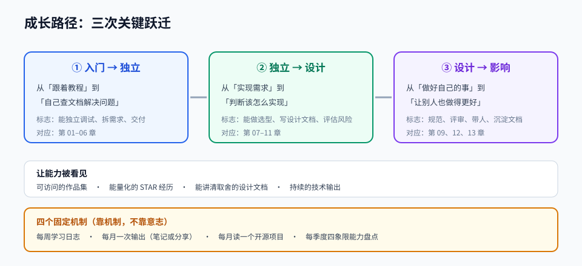

# 第 13 章 · 职业发展与面试

> 定位：技术能力要能被别人看见，才算真的具备。这一章教你如何表达与持续成长。
> 本章产出：一份简历、一个作品集入口、一份面试题库与一次模拟面试记录。

## 本章目标

- 把项目经历写成有说服力的简历条目，而不是技术名词堆砌。
- 建好作品集入口：可访问的仓库、可演示的线上地址、可读的文档。
- 掌握面试四类问题的回答框架：项目、基础、场景设计、行为。
- 建立可持续的学习机制，而不是靠短期冲刺。

## 文件索引

| 文件 | 内容 | 阅读方式 |
| --- | --- | --- |
| [01-作品集与简历.md](01-作品集与简历.md) | 项目包装、STAR 写法、简历结构与常见减分项 | 精读 + 改自己的简历 |
| [02-面试准备与持续成长.md](02-面试准备与持续成长.md) | 四类问题框架、高频题库、反问技巧、学习机制 | 精读 |
| [labs/01-求职材料与模拟面试.md](labs/01-求职材料与模拟面试.md) | 动手实验：产出求职材料并完成模拟面试 | 动手完成 |
| `assets/career-path.svg` | 成长阶段与能力跃迁路径 | 先看图 |

## 三条纪律

1. **用结果说话**：每条经历都写清「做了什么 → 带来什么变化 → 用什么量化」。
2. **只写你真的做过的**：面试官一定会追问细节，夸大等于自毁。
3. **持续输出**：写作、分享、开源任意一种都行，关键是让人能看到你的思考。

## 延伸阅读

- [tech-interview-handbook](https://github.com/yangshun/tech-interview-handbook)：面试准备手册，含行为面试模板。
- [coding-interview-university](https://github.com/jwasham/coding-interview-university)：算法与计算机基础长期计划。
- [system-design-primer](https://github.com/donnemartin/system-design-primer)：系统设计面试主教材。
- [developer-roadmap](https://github.com/nilbuild/developer-roadmap)：按目标岗位补齐能力缺口。

## 完成标准

- [ ] 简历中每个项目条目都符合「动作 + 技术 + 结果」结构，且不夸大。
- [ ] 作品集有可直接访问的链接，10 分钟内能被看懂。
- [ ] 准备好 5 个项目的深挖问题答案（含最难的问题与如何解决）。
- [ ] 完成一次模拟面试并记录三个待改进点。