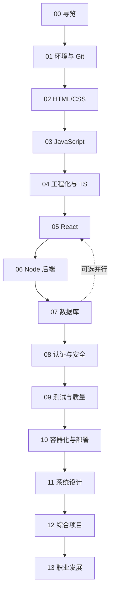

# 章节总览：14 章递进式全栈教程

> 每一章都是一个独立目录，包含 `README.md`（目标与索引）、若干讲义、`labs/`（动手实验）和 `assets/`（原理图）。
> 建议按顺序推进；跳章前请先确认已满足上一章的「完成标准」。

## 一、章节地图

| 章 | 主题 | 关键产出 | 建议学时 |
| --- | --- | --- | --- |
| 00 | 课程导览与学习方法 | 个人学习计划 + 能力自评 | 4h |
| 01 | 开发环境与命令行 | 可用的本地环境 + Git 协作流程 | 12h |
| 02 | HTML 与 CSS | 响应式个人主页 | 24h |
| 03 | JavaScript 核心 | 原生 JS 待办应用 | 32h |
| 04 | 前端工程化与 TypeScript | 从零搭建的 TS 工程 | 24h |
| 05 | React 与前端应用开发 | 带路由与数据请求的 SPA | 36h |
| 06 | Node.js 与后端服务 | 可测试的 REST API | 32h |
| 07 | 数据库与数据建模 | 博客数据库设计 + 迁移脚本 | 28h |
| 08 | 认证授权与 Web 安全 | 带登录鉴权的安全 API | 20h |
| 09 | 测试与代码质量 | 覆盖三层测试的项目 | 20h |
| 10 | 容器化、CI/CD 与部署 | 上线可访问的全栈应用 | 24h |
| 11 | 系统设计与架构 | 一份系统设计文档 | 28h |
| 12 | 综合实战项目 | 端到端全栈项目 | 60h |
| 13 | 职业发展与面试 | 简历 + 作品集 + 面试题库 | 16h |

## 二、依赖关系

- **主线（00→13）**：必须按序推进，后一章默认使用前一章的产出物。
- **可选并行**：第 07 章数据库与第 05 章 React 之间无强依赖，可交叉学习以缓解疲劳。
- **回环复习**：每完成一章，回看上一章的完成标准，确认没有知识债。

## 三、每章的固定结构

| 文件 | 读法 |
| --- | --- |
| `README.md` | 先读：明确目标、看图、浏览索引，再决定读哪份讲义 |
| `0x-*.md` 讲义 | 精读：概念 → 代码 → 常见坑 → 小结 |
| `labs/0x-*.md` | 动手：按步骤实现，最后逐条勾选验收清单 |
| `assets/*.svg` | 图：先看图建立直觉，学完再默画一遍 |

## 四、章节之外的资料

- 需要深挖某个主题时，回到 `../扩展阅读资料.md`，按章找对应条目。
- 忘了名词含义时，查 `../术语表.md`。
